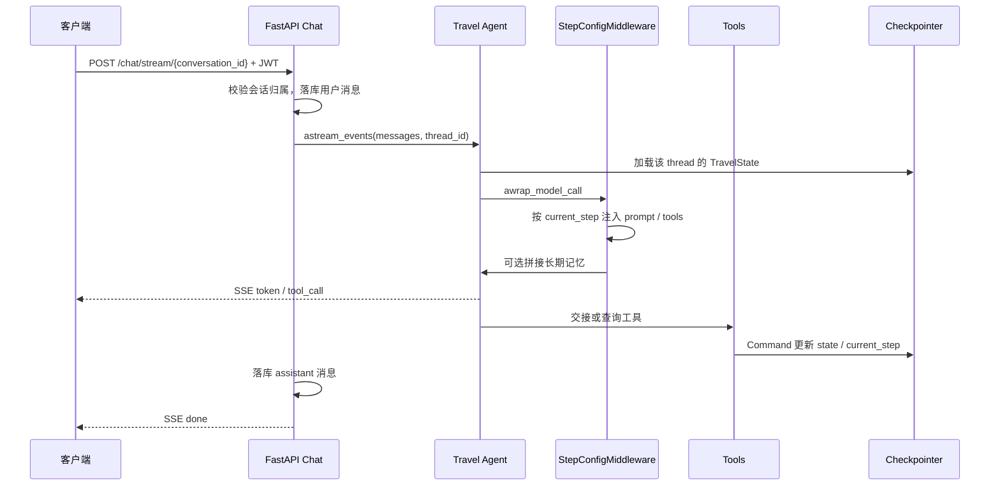
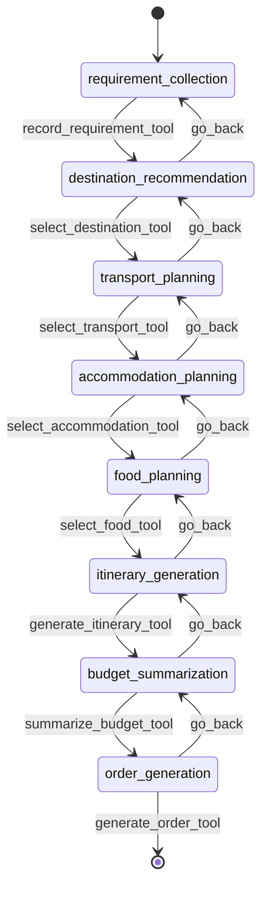

# TravelAgent

基于 **FastAPI + LangGraph + LangChain** 的多 Agent 旅行规划服务。用户通过对话完成「需求 → 目的地 → 交通 → 住宿 → 餐饮 → 行程 → 预算 → 订单」八步规划；系统用中间件按步骤动态裁剪能力，并用 MCP / RAG / 子 Agent 补齐外部信息。

## 核心设计思想

### 1. 用状态机管流程，而不是一次生成整份攻略

规划被拆成 8 个 `current_step`。Agent **不会**同时看到全部工具：`StepConfigMiddleware` 根据当前步骤注入对应的 system prompt 与工具列表。步骤切换由 **Handoff 工具**完成——工具返回 LangGraph `Command`，写入 `TravelState`（需求、目的地、交通方式等），并更新 `current_step`。回退工具（`go_back_to_*`）允许用户改主意而不丢会话。

这样做的目的：把「填表式规划」变成多轮对话，同时保证每一步有明确的前置依赖（`requires`），避免还没确认目的地就开始订酒店。

### 2. 三种 Agent 编排，各管一类复杂度

| 模式 | 用在哪 | 思路 |
|------|--------|------|
| **Handoffs** | 主旅行规划 | 单 Agent + 中间件换装，流程长、要持久化状态 |
| **Router** | 目的地信息 | 分类后并行 fan-out（攻略 RAG + 天气），再汇总报告 |
| **Subagents** | 交通规划 | 协调器把航班 / 高铁 / 自驾子 Agent 封装成工具，按用户偏好委托 |

主路径保持简单；只有「需要并行」或「需要领域专家」时才拆子图。

### 3. 双层记忆

- **短期记忆（Checkpointer）**：`AsyncPostgresSaver`，`thread_id` = 会话 ID，保存本轮 `TravelState` 与消息，刷新页面可续聊。
- **长期记忆（Store）**：`AsyncPostgresStore`，按 `user_id` 存画像（旅行风格、饮食禁忌/偏好、住宿偏好、出行历史）。中间件在调 LLM 前把记忆拼进 prompt；对话中提到新偏好时立刻调 `MEMORY_TOOLS` 落库。

业务表（用户、会话、消息）与 Agent 状态库职责分离：前者给产品 API，后者给图运行时。

### 4. 工具即边界

LLM 不直接打第三方 HTTP。酒店、地图、天气、搜索、12306、航班通过 **MCP** 暴露为 LangChain Tool；知识库通过 **RAG 工具**检索。主 Agent 只决定「何时调哪个工具」，真实副作用发生在工具实现里。

---

## 系统架构


### 一次对话的调用链



---

## 规划状态机



每步的 prompt、工具、前置字段定义在 `app/agents/handoffs/step_config.py`。中间件会校验 `requires`：例如交通规划必须已有 `user_requirement` 与 `selected_destination`。

---

## 目录结构

```
travelAgent/
├── app/
│   ├── main.py                 # FastAPI 入口与生命周期（Checkpointer / Store / MCP）
│   ├── config.py               # pydantic-settings，读取 .env
│   ├── api/v1/                 # 用户、会话、流式对话
│   ├── agents/
│   │   ├── handoffs/           # 主 Agent + 八步配置
│   │   ├── routers/            # 目的地并行 Router
│   │   └── subagents/          # 交通协调器与航班/高铁/自驾
│   ├── tools/                  # 交接、回退、RAG、MCP 筛选、记忆、查询封装
│   ├── core/                   # TravelState、中间件、Checkpointer、Store
│   ├── mcp_core/               # MCP 客户端与自建 weather/search server
│   ├── rag/                    # 文档、切分、向量库、混合检索、Pipeline
│   ├── models/ schemas/        # SQLAlchemy 业务模型与 Pydantic Schema
│   └── utils/
├── data/documents/             # 目的地攻略等 RAG 语料
├── tests/
├── scripts/
└── pyproject.toml
```

---

## 技术栈

| 类别 | 选型 |
|------|------|
| Web | FastAPI、Uvicorn、SSE |
| Agent | LangChain 1.x、LangGraph、create_agent + AgentMiddleware |
| LLM | 通义千问（OpenAI 兼容接口） |
| 记忆 | langgraph-checkpoint-postgres、AsyncPostgresStore |
| RAG | Chroma、sentence-transformers、BM25、jieba |
| 工具 | MCP（自建 stdio + 外部 streamable HTTP） |
| 业务库 | PostgreSQL、SQLAlchemy 2 async、JWT + bcrypt |
| 可观测 | LangSmith、Loguru |

Python 要求见 `pyproject.toml`（`requires-python >= 3.14`）。

---

## 快速开始

### 1. 依赖

- Python（与 `pyproject.toml` 一致）
- PostgreSQL
- （可选）Redis：配置项已预留，当前主路径未强制使用

建议用 [uv](https://github.com/astral-sh/uv) 或 pip 安装依赖：

```bash
uv sync
# 或
pip install -e .
```

### 2. 环境变量

在项目根目录创建 `.env`（`app/config.py` 会从项目根加载）。至少需要：

```env
DASHSCOPE_API_KEY=
LANGSMITH_API_KEY=
LANGSMITH_PROJECT=travel-planner-dev
LANGSMITH_TRACING=true

POSTGRES_HOST=localhost
POSTGRES_PORT=5432
POSTGRES_DB=
POSTGRES_USER=
POSTGRES_PASSWORD=

# MCP 相关（按你启用的服务填写）
AMAP_API_KEY=
TAVILY_API_KEY=
VARIFLIGHT_API_KEY=
AIGOHOTEL_MCP_API=
```

启动时 MCP 会连接：`weather`、`search`、`amap`、`12306-mcp`、`VariFlight-Aviation`、`aigohotel-mcp`。密钥缺失时对应外部服务会失败，自建 weather/search 仍可走 stdio。

### 3. 数据库

PostgreSQL 需对应用账号可写。应用启动时：

- Checkpointer / Store 会 `setup()` 自己的表
- 业务表由 SQLAlchemy 模型管理（见 `app/models/`）

请保证 `POSTGRES_*` 指向同一实例（或按你的部署拆库，但默认共用 `database_url`）。

### 4. 启动

```bash
python -m app.main
```

默认 `http://0.0.0.0:8000`，交互文档：`http://localhost:8000/docs`。

健康检查：`GET /`。

---

## HTTP API 摘要

基路径：`/api/v1`。除注册/登录外需 `Authorization: Bearer <token>`。

| 方法 | 路径 | 说明 |
|------|------|------|
| POST | `/users/register` | 注册，返回 JWT |
| POST | `/users/login` | 登录 |
| POST | `/conversations` | 新建会话 |
| GET | `/conversations` | 会话列表 |
| POST | `/chat/stream/{conversation_id}` | SSE 流式对话，body 含 `content` |
| GET | `/chat/history/{conversation_id}` | 历史消息 |

SSE 事件类型：`token`（增量文本）、`tool_call`（工具名）、`done`、`error`。`conversation_id` 同时作为 LangGraph `thread_id`。

---

## 关键模块对照

| 问题 | 看这里 |
|------|--------|
| Agent 怎么创建、挂了哪些工具 | `app/agents/handoffs/travel_agent.py` |
| 每一步说什么、能调什么 | `app/agents/handoffs/step_config.py` |
| 如何按步骤换 prompt/tools | `app/core/middleware.py` |
| 状态字段含义 | `app/core/state.py` |
| 步骤怎么前进 | `app/tools/state_transition.py` |
| 步骤怎么回退 | `app/tools/state_back.py` |
| 目的地并行查询 | `app/agents/routers/destination_router.py` |
| 交通子 Agent | `app/agents/subagents/` |
| MCP 接入 | `app/mcp_core/client.py` |
| RAG 管道 | `app/rag/Pipeline.py` |

---

## 测试

```bash
pytest
```

覆盖 MCP、RAG、handoffs、交通子 Agent、Checkpointer、记忆等（见 `tests/`）。部分用例依赖真实 LLM / MCP / 数据库，请按环境跳过或配置。

---

## 设计约束与注意点

- **CORS** 当前为 `allow_origins=["*"]`，上线必须改为前端域名。
- **异步工具必须 `await`**：例如 `ainvoke` 漏 await 会得到 `'coroutine' object is not subscriptable`（出现在 LangGraph `tools` 节点）。
- 主 Agent 每次对话会 `create_travel_agent()`；MCP 与 Checkpointer 在应用 lifespan 里单例初始化，避免重复拉起子进程。
- `TravelState` 里仍有 `report_generation` 字面量，步骤配置实际使用 `order_generation`，以实现代码为准。

---

## License

仅供本仓库协作与学习使用。
