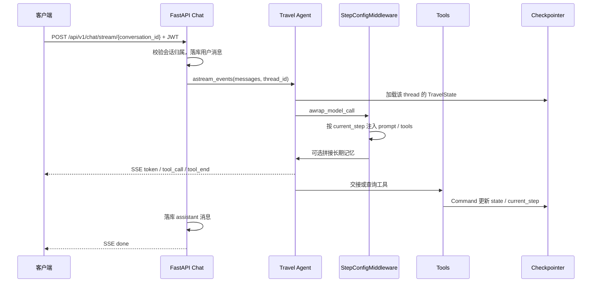
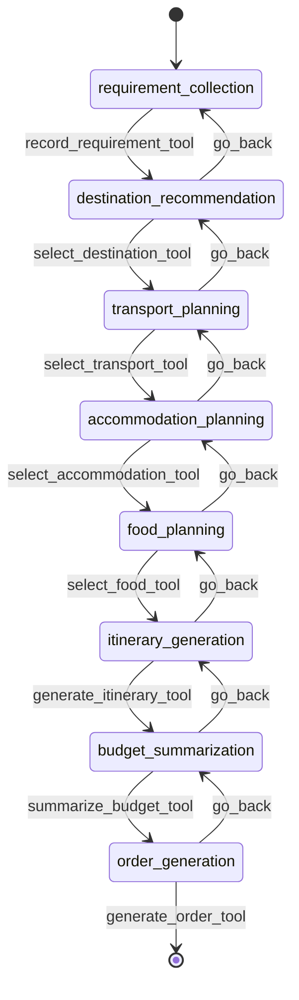

# TravelAgent

基于 **FastAPI + LangGraph + LangChain** 的多 Agent 旅行规划服务。用户通过多轮对话完成「需求 → 目的地 → 交通 → 住宿 → 餐饮 → 行程 → 预算 → 订单」八步规划；系统用中间件按步骤动态裁剪能力，并用 MCP / RAG / 子 Agent 补齐外部信息。

> 更细的架构与面试口径见 [docs/项目架构梳理与面试FAQ.md](docs/项目架构梳理与面试FAQ.md)、[docs/项目架构与重难点指南.md](docs/项目架构与重难点指南.md)。

## 核心设计思想

### 1. 用状态机管流程，而不是一次生成整份攻略

规划被拆成 8 个 `current_step`。Agent **不会**同时看到全部工具：`StepConfigMiddleware` 根据当前步骤注入对应的 system prompt 与工具列表。步骤切换由 **Handoff 工具**完成——工具返回 LangGraph `Command`，写入 `TravelState`（需求、目的地、交通方式等），并更新 `current_step`。回退工具（`go_back_to_*`）允许用户改主意，并清理下游已写入字段。

这样做的目的：把「填表式规划」变成多轮对话，同时保证每一步有明确的前置依赖（`requires`），避免还没确认目的地就开始订酒店。

### 2. 三种 Agent 编排，各管一类复杂度

| 模式 | 用在哪 | 思路 |
|------|--------|------|
| **Handoffs** | 主旅行规划 | 单 Agent + 中间件换装，流程长、要持久化状态 |
| **Router** | 目的地信息 | 分类后并行 fan-out（攻略 RAG + 天气），再汇总报告 |
| **Subagents** | 交通规划 | 协调器把航班 / 高铁 / 自驾子 Agent 封装成工具，按用户偏好委托 |

主路径保持简单；只有「需要并行」或「需要领域专家」时才拆子图。对外入口分别是 `query_destination_info` 与 `query_transport_options`。

### 3. 双层记忆

- **短期记忆（Checkpointer）**：`AsyncPostgresSaver`，`thread_id` = 会话 ID，保存本轮 `TravelState` 与消息，刷新页面可续聊。
- **长期记忆（Store）**：`AsyncPostgresStore`，按 `user_id` 存画像（旅行风格、饮食禁忌/偏好、住宿偏好、出行历史）。中间件在调 LLM 前把记忆拼进 prompt；对话中提到新偏好时立刻调 `MEMORY_TOOLS` 落库。

业务表（用户、会话、消息）与 Agent 状态库职责分离：前者给产品 API，后者给图运行时（默认同一 Postgres 实例、不同表）。

### 4. 工具即边界

LLM 不直接打第三方 HTTP。酒店、地图、天气、搜索、12306、航班通过 **MCP** 暴露为 LangChain Tool；知识库通过 **RAG 工具**按类目检索。主 Agent 只决定「何时调哪个工具」，真实副作用发生在工具实现里。

---

## 系统架构


### 一次对话的调用链


```mermaid
sequenceDiagram
  participant C as 客户端
  participant API as FastAPI Chat
  participant A as Travel Agent
  participant M as StepConfigMiddleware
  participant T as Tools
  participant CK as Checkpointer

  C->>API: POST /api/v1/chat/stream/{conversation_id} + JWT
  API->>API: 校验会话归属，落库用户消息
  API->>A: astream_events(messages, thread_id)
  A->>CK: 加载该 thread 的 TravelState
  A->>M: awrap_model_call
  M->>M: 按 current_step 注入 prompt / tools
  M->>A: 可选拼接长期记忆
  A-->>C: SSE token / tool_call / tool_end
  A->>T: 交接或查询工具
  T->>CK: Command 更新 state / current_step
  API->>API: 落库 assistant 消息
  API-->>C: SSE done
```

启动时 `lifespan` 会依次初始化：业务表 → Checkpointer → Store → MCP 多服务 → **RAG 管道预热**（避免首问美食/住宿时现场加载向量库导致长时间无输出）。

---

## 规划状态机


```mermaid
stateDiagram-v2
  [*] --> requirement_collection
  requirement_collection --> destination_recommendation: record_requirement_tool
  destination_recommendation --> transport_planning: select_destination_tool
  transport_planning --> accommodation_planning: select_transport_tool
  accommodation_planning --> food_planning: select_accommodation_tool
  food_planning --> itinerary_generation: select_food_tool
  itinerary_generation --> budget_summarization: generate_itinerary_tool
  budget_summarization --> order_generation: summarize_budget_tool
  order_generation --> [*]: generate_order_tool

  destination_recommendation --> requirement_collection: go_back
  transport_planning --> destination_recommendation: go_back
  accommodation_planning --> transport_planning: go_back
  food_planning --> accommodation_planning: go_back
  itinerary_generation --> food_planning: go_back
  budget_summarization --> itinerary_generation: go_back
  order_generation --> budget_summarization: go_back
```

每步的 prompt、工具、前置字段定义在 `app/agents/handoffs/step_config.py`。中间件会校验 `requires`：例如交通规划必须已有 `user_requirement` 与 `selected_destination`。

---

## 目录结构

```
travelAgent/
├── app/
│   ├── main.py                 # FastAPI 入口与生命周期（DB / Checkpointer / Store / MCP / RAG 预热）
│   ├── config.py               # pydantic-settings，读取项目根 .env
│   ├── api/v1/                 # 用户、会话 CRUD、流式对话
│   ├── agents/
│   │   ├── handoffs/           # 主 Agent + 八步配置
│   │   ├── routers/            # 目的地并行 Router
│   │   └── subagents/          # 交通协调器与航班/高铁/自驾
│   ├── tools/                  # 交接、回退、RAG、MCP 筛选、记忆、Router/交通封装
│   ├── core/                   # TravelState、中间件、Checkpointer、Store
│   ├── mcp_core/               # MCP 客户端与自建 weather/search server
│   ├── rag/                    # 切分、向量库、混合检索、重排、缓存、Pipeline
│   ├── models/ schemas/        # SQLAlchemy 业务模型与 Pydantic Schema
│   └── utils/
├── data/
│   ├── documents/              # 目的地/美食/住宿/贴士 Markdown 语料
│   └── vectorestore/           # Chroma 持久化目录
├── frontend/                   # 静态前端（Docker 下由 Nginx 托管）
├── deploy/nginx/               # Nginx 反代与 SSE 超时配置
├── docs/                       # 部署、架构、工具系统设计文档
├── tests/
├── scripts/
├── Dockerfile
├── docker-compose.yml
├── .env.example
└── pyproject.toml              # 依赖与 uv 索引（Python >= 3.14）
```

---

## 技术栈

| 类别 | 选型 |
|------|------|
| 包管理 | [uv](https://github.com/astral-sh/uv)（`uv.lock`） |
| Web | FastAPI、Uvicorn、SSE |
| Agent | LangChain 1.x、LangGraph、`create_agent` + `AgentMiddleware` |
| LLM | 通义千问（OpenAI 兼容接口，DashScope） |
| 记忆 | langgraph-checkpoint-postgres、AsyncPostgresStore |
| RAG | Chroma、DashScope Embeddings、BM25、jieba；可选 Redis 缓存 |
| 工具 | MCP（自建 stdio + 外部 streamable HTTP） |
| 业务库 | PostgreSQL、SQLAlchemy 2 async、JWT + bcrypt |
| 部署 | Docker Compose（Nginx + App + PostgreSQL + Redis） |
| 可观测 | LangSmith、Loguru |

---

## 能力一览

### RAG

- 管道：`AdvancedRAGPipeline`（查询优化 → 混合检索 → 可选 LLM 重排 → 父文档映射 → Redis 缓存）
- 工具按类目过滤：`search_destination_guide` / `search_food_recommendations` / `search_accommodation_info` / `search_travel_tips`
- 语料覆盖成都、武汉、青岛、重庆、长沙、咸宁等（见 `data/documents/`）
- 评测脚本：`tests/test_rag/ragas_eval.py`（需 `uv sync` 安装 dev 依赖）

### MCP 服务

| Server | 传输 | 说明 |
|--------|------|------|
| weather | stdio | 自建天气预报 |
| search | stdio | 自建旅行搜索（Tavily） |
| amap | streamable_http | 高德地图 |
| 12306-mcp | streamable_http | 火车票 |
| VariFlight-Aviation | streamable_http | 航班 |
| aigohotel-mcp | streamable_http | 酒店 |

密钥缺失时对应外部服务会失败；自建 weather / search 仍可走本地 stdio。

### 前端

`frontend/index.html` 经 Nginx 对外提供；`/api` 反代到 FastAPI。详见 [docs/前端经Nginx访问.md](docs/前端经Nginx访问.md)。

---

## 快速开始

### 1. 依赖

- Python（与 `pyproject.toml` 一致，`>= 3.14`）
- PostgreSQL（业务表 + Checkpointer + Store）
- Redis（可选；用于 RAG 查询缓存，连不上则自动降级为无缓存）

推荐用 [uv](https://github.com/astral-sh/uv) 安装：

```bash
uv sync
# 含测试 / Ragas 评测依赖
uv sync --group dev

# 或
pip install -e .
```

国内构建镜像加速见 [docs/DOCKER_MIRROR_CN.md](docs/DOCKER_MIRROR_CN.md)。

### 2. 环境变量

复制示例并填写密钥：

```bash
cp .env.example .env
```

至少需要：

```env
DASHSCOPE_API_KEY=
QWEN_MODEL_NAME=qwen-plus          # 也可按需改为其它通义模型
QWEN_BASE_URL=https://dashscope.aliyuncs.com/compatible-mode/v1

LANGSMITH_API_KEY=
LANGSMITH_PROJECT=travel-planner-dev
LANGSMITH_TRACING=true

POSTGRES_HOST=localhost
POSTGRES_PORT=5432
POSTGRES_DB=travel_planner_db
POSTGRES_USER=travel_user
POSTGRES_PASSWORD=secure_password

REDIS_HOST=localhost
REDIS_PORT=6379

# MCP（按你启用的服务填写）
AMAP_API_KEY=
TAVILY_API_KEY=
VARIFLIGHT_API_KEY=
AIGOHOTEL_MCP_API=
```

`app/config.py` 从项目根加载 `.env`。`VARIFLIGHT_*` / `AIGOHOTEL_*` 由 MCP 客户端通过环境变量读取。

### 3. 数据库

应用启动时：

- SQLAlchemy `init_db()` 创建业务表（用户 / 会话 / 消息）
- Checkpointer / Store 会 `setup()` 自己的表

请保证 `POSTGRES_*` 指向同一实例（或按部署拆库；默认共用 `database_url`）。

### 4. 本地启动

```bash
python -m app.main
# 或
uv run python -m app.main
```

默认 `http://0.0.0.0:8000`，交互文档：`http://localhost:8000/docs`。

健康检查：`GET /`。

### 5. Docker 一键部署

已提供 `Dockerfile` + `docker-compose.yml`（**Nginx 前端 + FastAPI + PostgreSQL + Redis**）。

- 通用说明：[docs/DOCKER_DEPLOY.md](docs/DOCKER_DEPLOY.md)
- 阿里云 CentOS（无域名 / 本机上传）：[docs/DEPLOY_ALIYUN_CENTOS.md](docs/DEPLOY_ALIYUN_CENTOS.md)

```bash
cp .env.example .env   # 填入 API Key 与数据库密码
docker compose up -d --build
# 浏览器访问 http://服务器IP/
```

---

## HTTP API 摘要

基路径：`/api/v1`。除注册/登录外需 `Authorization: Bearer <token>`。

| 方法 | 路径 | 说明 |
|------|------|------|
| POST | `/users/register` | 注册，返回 JWT |
| POST | `/users/login` | 登录 |
| GET | `/users/me` | 当前用户信息 |
| POST | `/conversations` | 新建会话 |
| GET | `/conversations` | 会话列表 |
| GET | `/conversations/{id}` | 会话详情 |
| PATCH | `/conversations/{id}` | 更新会话（如标题） |
| DELETE | `/conversations/{id}` | 软删除会话 |
| POST | `/chat/stream/{conversation_id}` | SSE 流式对话，body 含 `content` |
| GET | `/chat/history/{conversation_id}` | 历史消息 |

SSE 事件类型：`token`（增量文本）、`tool_call`、`tool_end`、`done`、`error`。  
Router / RAG / 子 Agent 的内部 token 不会泄漏到前端。`conversation_id` 同时作为 LangGraph `thread_id`。

---

## 关键模块对照

| 问题 | 看这里 |
|------|--------|
| Agent 怎么创建、挂了哪些工具 | `app/agents/handoffs/travel_agent.py` |
| 每一步说什么、能调什么 | `app/agents/handoffs/step_config.py` |
| 如何按步骤换 prompt/tools | `app/core/middleware.py` |
| 状态字段含义 | `app/core/state.py` |
| 步骤怎么前进 | `app/tools/state_transition.py` |
| 步骤怎么回退 | `app/tools/state_back.py` |
| 目的地并行查询 | `app/agents/routers/destination_router.py`、`app/tools/router_query.py` |
| 交通子 Agent | `app/agents/subagents/`、`app/tools/transport_query.py` |
| MCP 接入与筛选 | `app/mcp_core/client.py`、`app/tools/mcp_tools.py` |
| RAG 管道与工具 | `app/rag/Pipeline.py`、`app/tools/rag_tools.py` |
| 工具分层设计 | [docs/工具系统设计文档.md](docs/工具系统设计文档.md) |

---

## 测试

```bash
uv sync --group dev
pytest
```

覆盖 MCP、RAG、handoffs、交通子 Agent、Checkpointer、记忆等（见 `tests/`）。部分用例依赖真实 LLM / MCP / 数据库，请按环境跳过或配置。

---

## 设计约束与注意点

- **CORS** 当前为 `allow_origins=["*"]`，上线必须改为前端域名。
- **异步工具必须 `await`**：例如 `ainvoke` 漏 await 会得到 `'coroutine' object is not subscriptable`（出现在 LangGraph `tools` 节点）。
- 主 Agent 每次对话会 `create_travel_agent()`；MCP、Checkpointer、Store 在应用 lifespan 里单例初始化，避免重复拉起子进程或连接池。
- JWT 签名密钥当前与业务配置绑定，生产环境建议改为独立 `SECRET_KEY`。
- Redis 仅服务 RAG 缓存；未启动时应用仍可运行，只是缓存降级。

---

## 文档索引

| 文档 | 内容 |
|------|------|
| [docs/DOCKER_DEPLOY.md](docs/DOCKER_DEPLOY.md) | Docker 通用部署 |
| [docs/DEPLOY_ALIYUN_CENTOS.md](docs/DEPLOY_ALIYUN_CENTOS.md) | 阿里云 CentOS 部署 |
| [docs/DOCKER_MIRROR_CN.md](docs/DOCKER_MIRROR_CN.md) | 国内镜像与 PyPI 加速 |
| [docs/前端经Nginx访问.md](docs/前端经Nginx访问.md) | 前端与 `/api` 反代 |
| [docs/工具系统设计文档.md](docs/工具系统设计文档.md) | 工具分层 / MCP / Tool-as-Agent |
| [docs/项目架构与重难点指南.md](docs/项目架构与重难点指南.md) | 架构重点、难点与 backlog |
| [docs/项目架构梳理与面试FAQ.md](docs/项目架构梳理与面试FAQ.md) | 面试 FAQ |

---

## License

仅供本仓库协作与学习使用。
