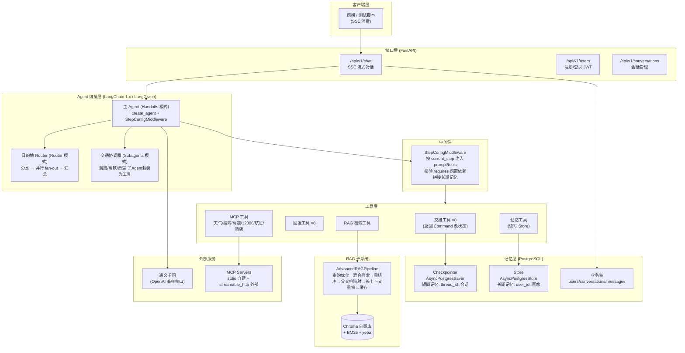
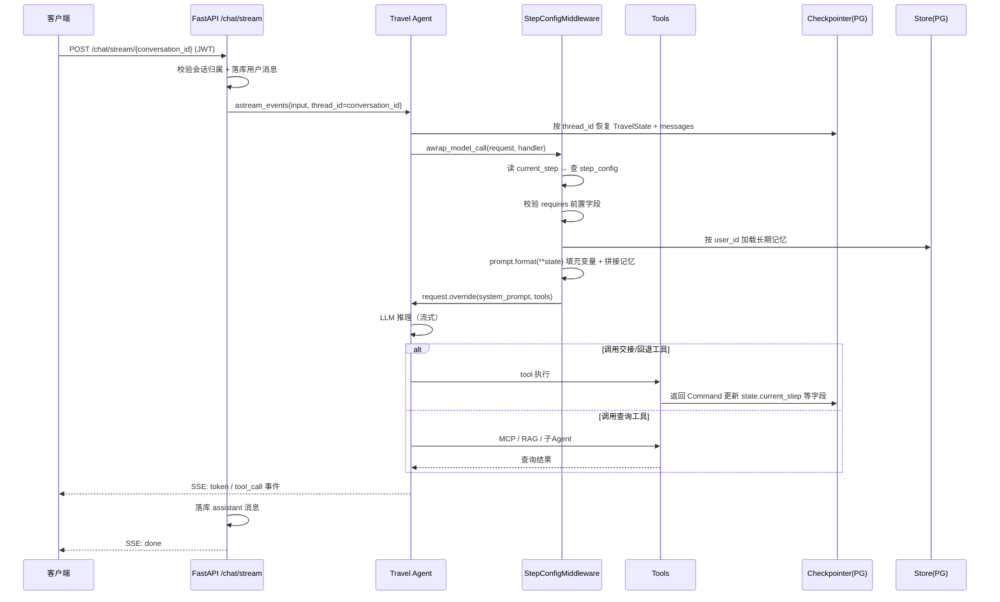
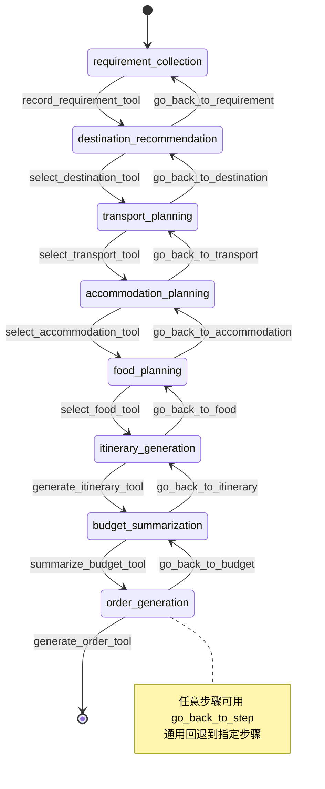

# TravelAgent 项目架构与重难点指南

> 本文档基于对代码库的完整阅读整理，用于：
> 1. 梳理系统整体架构
> 2. 标出必须掌握的**重点**与**难点**（面试/答辩/继续开发都绕不开）
> 3. 列出当前代码中**已发现的问题与待完善清单**，作为后续迭代 backlog
>
> 建议配合 `README.md` 一起阅读。你可以按章节逐一向我提问。

---

## 一、项目一句话概括

基于 **FastAPI + LangGraph/LangChain 1.x + PostgreSQL + MCP + RAG** 的多 Agent 旅行规划系统：
用户通过多轮对话，按「需求 → 目的地 → 交通 → 住宿 → 餐饮 → 行程 → 预算 → 订单」**八步状态机**完成规划；
系统通过**中间件按步骤动态裁剪 prompt 和工具**，通过 **Checkpointer + Store 双层记忆**实现会话续聊与用户画像，通过 **MCP / RAG / 子 Agent** 获取外部实时信息。

---

## 二、系统架构

### 2.1 分层架构图



### 2.2 一次对话的完整调用链



### 2.3 八步规划状态机



### 2.4 三种 Agent 编排模式（这是本项目最有设计感的部分）

| 模式 | 位置 | 解决的问题 | 核心机制 |
|------|------|-----------|---------|
| **Handoffs（单 Agent + 中间件换装）** | `app/agents/handoffs/` | 流程长、步骤间有强依赖、需要持久化 | 一个 Agent，`StepConfigMiddleware` 每轮按 `current_step` 换 prompt + 工具列表；交接工具返回 `Command` 推进状态 |
| **Router（分类 + 并行 fan-out）** | `app/agents/routers/destination_router.py` | 一个查询需要多路信息（攻略 + 天气） | 分类器（结构化输出）→ `Send` 并行派发 → synthesizer 汇总 |
| **Subagents（协调器 + 领域专家）** | `app/agents/subagents/` | 交通是独立复杂领域，需要专家分工 | 航班/高铁/自驾三个子 Agent 被 `@tool` 包装成工具，协调器按需求委托 |

**设计哲学**：主路径保持简单（单 Agent），只有「需要并行」或「需要领域专家」时才拆子图。这是面试时讲架构取舍的好素材。

### 2.5 双层记忆设计

| | 短期记忆 | 长期记忆 |
|--|---------|---------|
| 组件 | `AsyncPostgresSaver`（Checkpointer） | `AsyncPostgresStore` |
| 键 | `thread_id` = conversation_id | `user_id` |
| 存什么 | `TravelState` 全部字段 + 消息历史 | 用户画像：旅行风格、饮食禁忌/偏好、住宿偏好、出行历史 |
| 何时读 | 每次 `astream_events` 自动恢复 | 中间件在调 LLM 前拼进 system prompt |
| 何时写 | LangGraph 运行时自动 checkpoint | 对话中提到新偏好时，Agent 主动调 `MEMORY_TOOLS` 落库 |
| 代码 | `app/core/Checkpointer.py` | `app/core/store.py` + `app/core/memory_model.py` |

**职责分离**：业务表（users/conversations/messages）给产品 API 用；Agent 状态库（checkpoint/store）给图运行时用。两者共用同一个 PostgreSQL 实例但表完全独立。

---

## 三、必须掌握的重点（核心知识点）

> 这些是「懂这个项目」的最低门槛，每一条都对应具体代码。

### 重点 1：LangGraph 状态机与 `Command` 交接机制 ⭐⭐⭐
- `TravelState` 继承 `AgentState`，用 `TypedDict + NotRequired` 定义全部业务字段（`app/core/state.py`）。
- 交接工具（如 `record_requirement_tool`）通过 `runtime: ToolRuntime` 拿到上下文，返回 `Command(update={...})` **同时更新业务字段和 `current_step`**，并用 `ToolMessage` 给 LLM 反馈（`app/tools/state_transition.py`）。
- **要能说清楚**：为什么用工具返回 `Command` 而不是让 LLM 直接改 state？（答：状态变更是副作用，必须走工具边界，可校验、可回退、可持久化。）

### 重点 2：AgentMiddleware 动态裁剪（`awrap_model_call`）⭐⭐⭐
- `StepConfigMiddleware.awrap_model_call` 在**每次调用 LLM 前**拦截请求，做四件事（`app/core/middleware.py`）：
  1. 读 `current_step` → 查 `step_config`
  2. 校验 `requires` 前置字段（没确认目的地就不允许订酒店）
  3. 加载长期记忆拼进 prompt
  4. `prompt.format(**flat_state)` 填充变量，`request.override()` 替换 system_prompt 和 tools
- **要能说清楚**：为什么不让一个 Agent 挂全部 40+ 工具？（答：工具太多会稀释 LLM 注意力、增加 token 成本、提高误调用率；按步骤裁剪是「能力最小化」原则。）

### 重点 3：Checkpointer / Store 的单例 + 生命周期管理 ⭐⭐
- 双重检查锁（double-checked locking）的**异步单例**模式：`CheckpointerManager` / `StoreManager` / `MCPClientManager` 都是同一套写法。
- 在 FastAPI `lifespan` 中用 `@asynccontextmanager` 嵌套管理：启动时建连接池 → `yield` → 关闭时释放（`app/main.py`）。
- **要能说清楚**：为什么 MCP/连接池必须在 lifespan 里初始化而不是每次请求新建？（答：stdio MCP 会拉起子进程，PG 连接池建立有开销，重复创建会拖垮服务。）

### 重点 4：MCP 工具接入 ⭐⭐
- `MultiServerMCPClient` 统一管理两种传输：**stdio**（自建 weather/search server，子进程）和 **streamable_http**（高德、12306、VariFlight、aigohotel）。
- `app/tools/mcp_tools.py` 按关键词从全部 MCP 工具中**筛选子集**（如 `get_hotel_tools`），供不同步骤按需挂载。
- **要能说清楚**：MCP 相对直接调 HTTP API 的优势（标准化协议、工具自描述、跨进程/跨语言复用）。

### 重点 5：高级 RAG 管道 ⭐⭐
完整链路（`app/rag/Pipeline.py`）：
```
查询 → 缓存命中? → 查询优化(multi_query) → 混合检索(向量+BM25, k×3)
     → LLM重排序(可选) → 父文档映射(小块检索、大块给上下文)
     → 长上下文重排(Lost-in-the-middle 缓解) → 返回 top_k
```
- **要能说清楚**：为什么用父子文档切分？为什么混合检索优于纯向量？为什么重排（rerank）放在检索之后？

### 重点 6：SSE 流式输出 ⭐⭐
- `astream_events(version="v2")` 捕获 `on_chat_model_stream`（token）和 `on_tool_start`（工具调用）两类事件，逐 token 推给前端（`app/api/v1/chat.py`）。
- 响应头 `X-Accel-Buffering: no` 禁用 Nginx 缓冲——这是 SSE 部署的经典坑。

### 重点 7：异步 Python 全家桶 ⭐⭐
- 全链路 async：FastAPI → SQLAlchemy 2 async → `AsyncPostgresSaver` → `ainvoke`/`astream_events`。
- 经典坑：异步工具漏 `await` → `'coroutine' object is not subscriptable`。

---

## 四、必须攻克的难点（容易出错 / 面试深挖点）

### 难点 1：状态一致性与步骤跳转的原子性 ⭐⭐⭐
- 交接工具要**同时**写业务字段 + 更新 `current_step` + 返回 `ToolMessage`，三件事在一个 `Command` 里完成，否则会出现「步骤跳了但数据没存上」的中间态。
- `requires` 校验失败时直接 `raise ValueError`——目前这个异常会冒泡到 SSE 的 `error` 事件，**没有引导 Agent 自我修复**（比如自动回退到能满足前置的步骤）。这是一个可以深挖的改进点。

### 难点 2：提示词变量填充的脆弱性 ⭐⭐⭐
- `step_config` 的 prompt 里有大量 `{selected_destination}`、`{travel_days}` 占位符，中间件用 `str.format(**flat_state)` 填充。
- 风险：state 缺字段 → `KeyError` → 当前实现是**降级为原始模板**（占位符原样暴露给 LLM！），LLM 会看到 `{selected_destination}` 这种脏 prompt。
- 改进方向：用安全的模板渲染（如 `defaultdict` 缺省值、或 LangChain 的 `PromptTemplate` 部分填充）。

### 难点 3：回退（Rollback）设计 ⭐⭐
- 8 个专用回退工具 + 1 个通用 `go_back_to_step`，回退时要考虑：**已收集的下游数据要不要清掉**？（比如换了目的地，之前查的酒店还有效吗？）
- 当前实现主要改 `current_step`，数据清理策略值得审视——这是状态机设计里最考验业务理解的部分。

### 难点 4：并行 fan-out 的状态合并 ⭐⭐
- Router 模式里 `agent_results: Annotated[list, add]` 用 **reducer** 合并并行节点的返回值——这是 LangGraph 并行分支的核心机制，不理解 reducer 就会踩「并行节点互相覆盖状态」的坑。

### 难点 5：子 Agent 封装为工具的上下文隔离 ⭐⭐
- 交通子 Agent 被 `@tool` 包装后，主 Agent 只能看到工具的**字符串返回值**，子 Agent 的中间推理过程对主 Agent 不可见。这是有意的上下文隔离（省 token、降复杂度），但也意味着错误信息会被压缩。

### 难点 6：Windows 下的异步事件循环 ⭐
- `main.py` 里注释掉了 `asyncio.WindowsSelectorEventLoopPolicy`——psycopg 异步连接在 Windows 默认的 ProactorEventLoop 下有兼容问题，这是跨平台部署的经典坑。

---

## 五、已发现的问题与完善清单（Backlog）

> 我在读代码时发现的具体问题，按优先级排序，可作为后续迭代清单。

### P0 - 正确性问题

| # | 问题 | 位置 | 说明 |
|---|------|------|------|
| 1 | **步骤枚举不一致** | `app/core/state.py` | `PlanningStep` 写的是 `report_generation`，但 `step_config.py` 实际用 `order_generation`。`current_step` 类型标注与实际值不符 |
| 2 | **RAG Pipeline else 分支重复调用** | `app/rag/Pipeline.py` | `use_llm_reranker=False` 时 `get_parent_context(child_docs)` 被调了**两次**（第 101 和 105 行），是明显的复制粘贴 bug |
| 3 | **天气 Agent 是 mock 数据** | `app/agents/routers/destination_router.py` | `weather_agent_node` 返回硬编码天气，TODO 标注了但未接真实 API（其实已有 weather MCP server 可用） |
| 4 | **`from _operator import add`** | `destination_router.py` 第 4 行 | 用了 CPython 内部模块 `_operator`，应改为 `from operator import add` |
| 5 | **prompt 变量缺失时泄露占位符** | `app/core/middleware.py` | `KeyError` 降级方案会把 `{xxx}` 原样发给 LLM |

### P1 - 性能与资源

| # | 问题 | 位置 | 说明 |
|---|------|------|------|
| 6 | **每次请求重建 Agent** | `app/api/v1/chat.py` | 每个 SSE 请求都 `create_travel_agent()`，重新加载全部工具配置。Agent 本身无状态（状态在 Checkpointer），可以做成应用级单例 |
| 7 | **消息历史无截断策略** | 全局 | 长对话会把全部 messages 发给 LLM，token 会膨胀。需要 summarization 或窗口截断中间件 |
| 8 | **RAG 缓存** | `app/rag/cache.py` | 需确认缓存失效策略（语料更新后缓存是否过期） |

### P2 - 健壮性与安全

| # | 问题 | 位置 | 说明 |
|---|------|------|------|
| 9 | **CORS 全开** | `app/main.py` | `allow_origins=["*"]` + `allow_credentials=True` 是危险组合，上线必须收敛 |
| 10 | **SSE 错误直接暴露 `str(e)`** | `app/api/v1/chat.py` | 内部异常信息（可能含数据库细节）直接推给客户端 |
| 11 | **步骤校验异常无自愈** | `app/core/middleware.py` | `requires` 校验失败直接 raise，可改为返回「引导回退」的友好消息 |
| 12 | **MCP 外部服务无降级** | `app/mcp_core/client.py` | 外部 MCP（12306/航班/酒店）挂掉时，对应步骤会直接失败，缺少 fallback 提示策略 |

### P3 - 工程化

| # | 问题 | 说明 |
|---|------|------|
| 13 | 测试依赖真实 LLM/MCP/数据库 | 需要 mock 层或标记 `@pytest.mark.skipif`，否则 CI 跑不起来 |
| 14 | 缺少 Docker / docker-compose | PostgreSQL + 应用的一键起环境 |
| 15 | `synthesizer_node` 简单拼接 | Router 汇总目前是字符串拼接，TODO 用 LLM 生成连贯报告 |
| 16 | 无线流式背压/限流 | SSE 端点没有并发限制和速率限制 |

---

## 六、建议的提问/学习路径

按这个顺序向我提问，可以从主干到细节逐步吃透：

1. **状态机与 Command**：交接工具是怎么改状态的？`ToolRuntime` 是什么？
2. **中间件机制**：`awrap_model_call` 的执行时机？`request.override` 做了什么？
3. **记忆系统**：Checkpointer 和 Store 的表结构长什么样？thread_id 怎么工作？
4. **MCP**：stdio 和 streamable_http 的区别？工具筛选怎么做的？
5. **RAG**：父子文档切分、混合检索、重排序各自解决什么问题？
6. **三种编排模式**：什么场景该用 Router / Subagents / Handoffs？
7. **SSE 流式**：`astream_events` 有哪些事件类型？前端怎么消费？
8. **Backlog 逐项攻坚**：从 P0 的 5 个正确性问题开始修。

---

*文档生成时间：2026-09-23，基于 commit `5032b4e` 的代码。*
